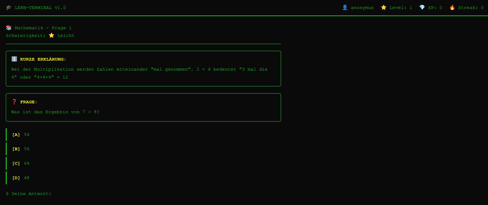

# 🎓 Terminal4Kidz2Learn

---

## 🇩🇪 Deutsch

Ein Quiz-Lernspiel im Terminal-Look für Kinder. Wissen aus Mathematik, Geographie und Naturwissenschaft wird spielerisch mit einem Punkte- und XP-System vermittelt.

**Technologie:** Vue 3 · TypeScript · Pinia · Vite · MVVM-Architektur

**Starten:**
```bash
npm install
npm run dev
```



---

## 🇬🇧 English

A quiz learning game with a terminal look designed for kids. Topics include Math, Geography and Science — taught through a points and XP system.

**Tech Stack:** Vue 3 · TypeScript · Pinia · Vite · MVVM Architecture

**Getting started:**
```bash
npm install
npm run dev
```
